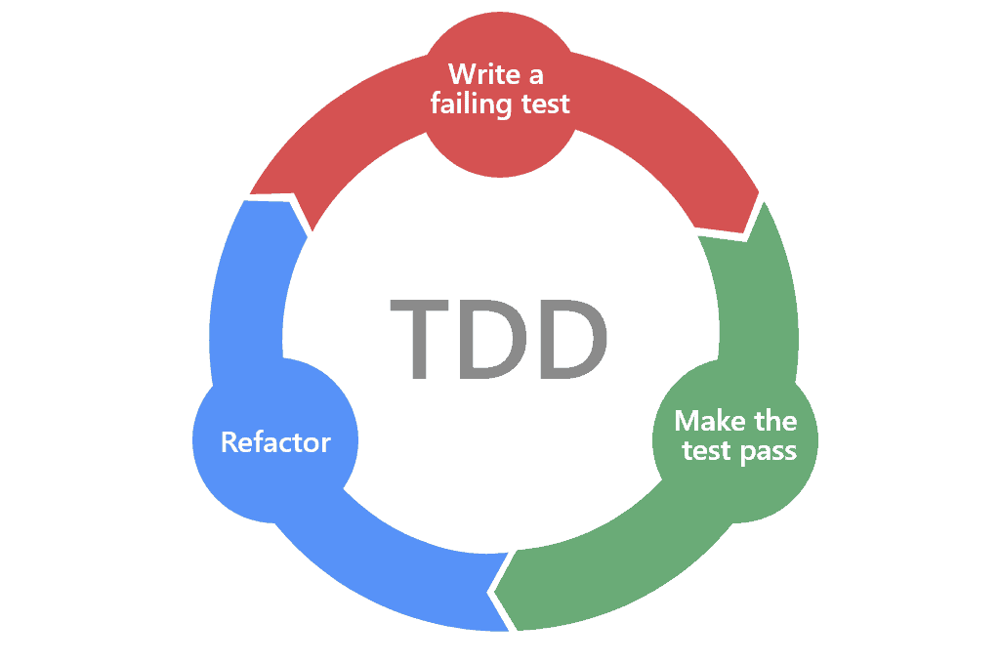

# TDD Java Examples

2023.10.21

> **참고 자료**
> 
> 문헌:
> - [최범균, _테스트 주도 개발 시작하기_. 가메 출판사, 2022](https://product.kyobobook.co.kr/detail/S000001248962)
>
> 온라인 자료:
> - [JAVA/자바 플레이그라운드 with TDD, 클린코드](https://edu.nextstep.camp/c/9WPRB0ys) 
> - [세미나 공유 - TDD 테스트 작성 순서, 기능 명세, 그리고 시연 한 번 더](https://www.youtube.com/watch?v=rs_ReNmLISw)

## TDD란?

> 테스트로부터 시작하는 개발 방식

- 매우 짧은 개발 사이클을 반복하는 소프트웨어 개발 프로세스이다.
- TDD는 단순한 설계를 장려하고, 자신감을 불어넣어 준다.

## TDD의 흐름

TDD는 아래와 같은 사이클을 반복한다.

1. 실패하는 테스트 코드를 작성한다.
2. 테스트를 통과하기 위한 최소한의 코드를 구현한다.
3. 작성한 코드를 리팩토링한다.

위 사이클을 반복하면서 점진적으로 기능을 완성해 나가는 것이 전형적인 TDD의 흐름이다.

## 테스트 코드는 왜 필요할까?

- 개발자는 소프트웨어의 기능을 검증하는 역할을 수행한다.
- 기능 검증은 정상적인 경우와 예외 상황에 대해 모두 수행되어야 한다.
- 개발자가 수동으로 검증하면 예외 상황을 검증하기 어렵고, 검증 범위 누락이 발생하기 쉽다.
- 그렇기 때문에 자동화된 테스트가 필요하다.
- 자동화된 테스트는 **실행할 수 있는 테스트**를 말한다.
- 자동화된 테스트를 사용하면 코드 수정에 대한 빠른 피드백 받을 수 있고, 테스트가 쌓일수록 검증 범위를 점진적으로 넓일 수 있다.

> TDD를 하는 이유도 테스트 코드가 주는 이점과 비슷한다. 그러나 단순히 자동화된 테스트를 작성하는 것이 TDD를 말하는 것은 아니다. TDD는 테스트 기술이라기보단 분석/설계 기술이다.

# TDD 원칙

1. 실패하는 단위 테스트를 작성할 때까지 프로덕션 코드를 작성하지 않는다.
2. 컴파일은 실패하지 않으면서 실행이 실패하는 정도로만 단위 테스트를 작성한다.
3. 현재 실패하는 테스트를 통과할 정도로만 실제 코드를 작성한다.

> 원칙 3은 오버 엔지니어링을 요구하지 않는다. 테스트를 통과할 정도로만 실제 코드를 작성하는 것이 우선이다.

## TDD는 설계를 지원한다.

TDD 사이클에서 개발자는 테스트 코드를 먼저 작성한다.

이때 테스트를 실행하기 위해 개발자는 설계에 대해 고민해야 한다. 기능에 대한 클래스나 함수의 이름, 매개변수, 리턴 값 등을 고민하고, 설계한 내용을 토대로 테스트 코드를 작성하면 리턴 값을 통해 결과를 검증한다.

이러한 흐름은 개발자가 먼저 설계에 대해 고민하고, 설계를 먼저 마칠 수 있도록 유도한다.

# TDD 테스트 작성 순서

테스트 코드는 어디서부터 작성해야 할까? 많은 자료에서 다음과 같은 흐름을 권장하고 있다.

> 테스트 코드는 쉽거나 예외적인 경우부터 시작해서 점진적으로 어려운, 또는 정상적인 경우의 순서대로 작성한다. 

- 어려운 것부터 먼저 테스트 하는 경우
  - 구현할 것이 많아진다. 따라서 테스트 코드가 주는 피드백을 받는데 오랜 시간이 걸리고, 테스트가 실패하는 경우 오류를 수정하는 시간도 오래 걸린다.
- 예외적인 상황을 나중에 테스트 하는 경우
  - 기존에 구현했던 코드에 더 많은 영향을 미칠 수 있다.
  - 예외 상황을 먼저 구현했을 때와 비교해서 코드가 더 복잡해질 수 있다.

> TDD 작성 시 완급 조절도 중요하다. 오버 엔지니어링은 TDD의 다음 사이클을 진행하는데 어려움을 줄 수 있다. 현재 테스트 대상에 대한 구현을 진행하되, 앞서 나가지 않는 것이 좋다.
